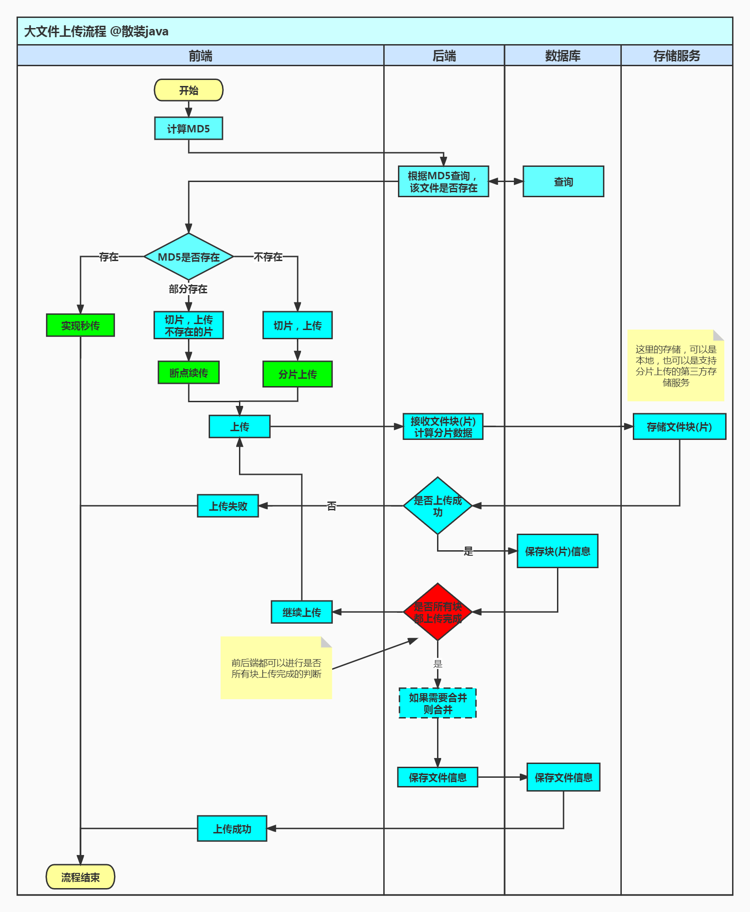

# 大文件上传
本示例项目，能够实现，<mark>大文件分片上传、秒断以及断点续传</mark>的功能。

注意：本程序仅仅是实例项目，提供思路，企业应用请做相应的完善！

更多介绍请参考个人网站: <https://doc.bulkall.top/spring/big-file/>

### 技术点
> 为了方便演示使用，本项目使用的是前后端不分离的架构

前端

- 文件操作使用 simple-uploader [GitHub]( https://github.com/simple-uploader/vue-uploader) 、[参数说明](https://github.com/simple-uploader/Uploader/blob/develop/README_zh-CN.md)
    - 使用前一定要去一下 simple-uploader 相关参数，钩子函数等，不然会迷茫
- 签名使用 spark-md5.js
- 页面用的 element-ui

后端

- SpringBoot 2.7
- mysql 5.7
- myBats-plus 3.5.2

### simple-uploader 使用参考问题

- [博客1](https://www.cnblogs.com/xiahj/p/vue-simple-uploader.html)
- [问题点]( https://www.cnblogs.com/xiahj/p/15950975.html)
- 参考项目[地址](https://github.com/shady-xia/vue-uploader-solutions)

### 项目运行

1. 确保文件上传路径 默认是 D:\tmp\file 可在 application.yml 中进行修改
2. 链接到自己的数库，导入 db 目录下面的两张表 [sql](db/db.sql)
2. 分片大小，前后端要对应**相同**才行（默认是相同的不用改）
3. [BulkBigFileDemoApplication](src/main/java/top/bulk/big/BulkBigFileDemoApplication.java) 是启动类，直接启动即可
4. 启动后访问：http://localhost:8080/page/index.html

### 项目设计流程
> 这里我们将整个流程的参与者分为，前端（页面）、后端、数据库、存储服务

