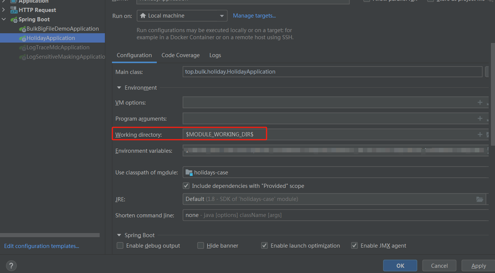

# 获取全年节假日

### 概述

项目开发中，经常会用到节假日相关的接口查询能力

**场景举例**

- 查询放假日期
- 查询具体日子发送问候短信消息的场景

但是

平时在开发的过程中经常会用到查询节假日的功能，但由于节假日是每年由国务院统一公布，我们 无法通过计算获取节假日，所以一般需要我们手动来维护节假日。

### 基本思路

1. 市面上有些现成的别人做好的接口，可之类调用，但是这样就会强依赖别人的接口
    1. [提莫](http://timor.tech/api/holiday)
2. 可以去查询国务院放假通知，也是去查询别人的，相对会权威
    1. 地址：[国务院链接](https://www.gov.cn/gongbao/2023/issue_10806/202311/content_6913823.html) -> 自行检索
3. hutool 工具类中也有几个工具类可以帮助啊判断那天是不是什么节日

   ```java
   ChineseDate date = new ChineseDate(DateUtil.parseDate("2022-06-03"));
   String festivals = date.getFestivals();
   ```
4. 自己维护一个接口，即 每年的假期自己田填入，之后供其他业务场景使用

### 测试

注意，该项目为多模块环境下，演示，启动时候，必须做配置 Work directory。因为本项目使用 `System.getProperty("user.dir")` 加载的json文件

在Run-Run/Debug Configurations里，调整Work directory为$MODULE_WORKING_DIR$，然后保存



启动后，访问 http://localhost:8080/

效果
